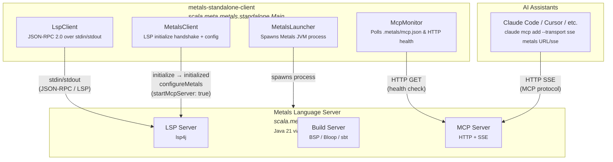

# Architecture

## Process Diagram

## How It Works

The **standalone client** acts as a **headless LSP client** — it replaces VS Code/Neovim as the "editor" side of the LSP protocol. Its sole purpose is to:

1. **Launch** the real Metals language server as a subprocess via Coursier
2. **Perform the LSP handshake** (initialize, initialized, etc.) over stdin/stdout using JSON-RPC 2.0
3. **Enable Metals' built-in MCP server** by sending `startMcpServer: true` in the configuration
4. **Monitor** that the MCP HTTP endpoint comes up healthy

Once both processes are running, the Metals MCP server exposes an **HTTP+SSE endpoint** that AI assistants like Claude Code can connect to, giving them access to Scala language intelligence (definitions, references, diagnostics, etc.) — all without needing an actual editor open.

## Components

| Component | File | Role |
|---|---|---|
| `MetalsLauncher` | `MetalsLauncher.scala` | Discovers Metals installations (Coursier, sbt, JAR, PATH) and spawns the JVM process |
| `LspClient` | `LspClient.scala` | Implements JSON-RPC 2.0 over stdin/stdout, handles server notifications and requests |
| `MetalsClient` | `MetalsClient.scala` | Drives the LSP initialize handshake and sends configuration to enable MCP |
| `McpMonitor` | `McpMonitor.scala` | Watches for `.metals/mcp.json`, extracts the MCP URL, and polls server health |
| `Main` / `MetalsLight` | `Main.scala` | Entry point that orchestrates all components in sequence |
